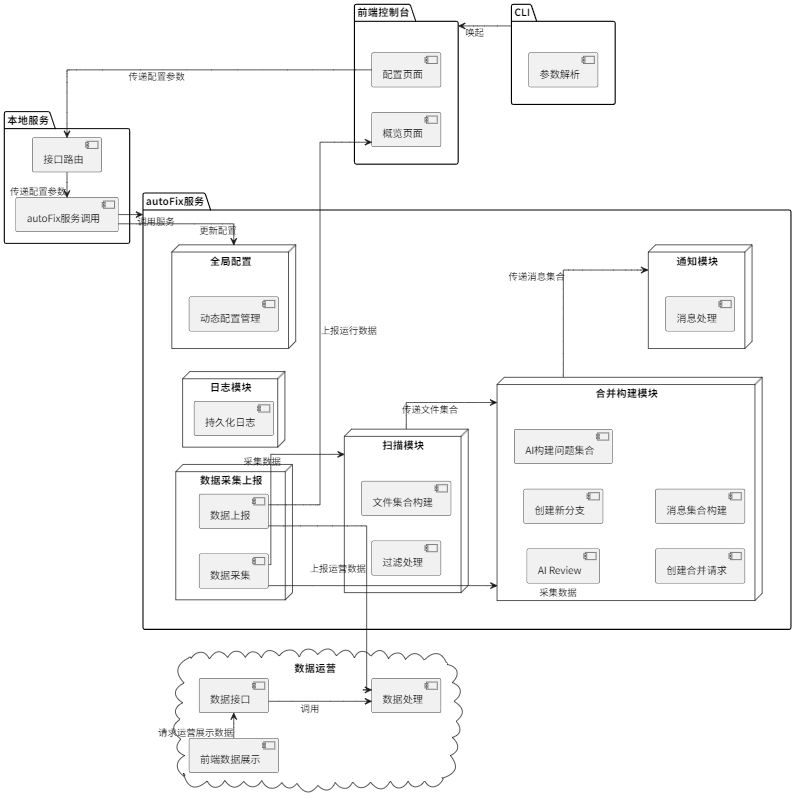
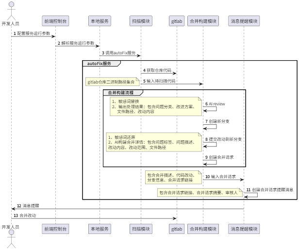

#### **1. 背景：技术债的挑战与现有方法的局限**

在软件开发实践中，技术债的产生几乎无法避免。其根源可能在于早期的设计局限、技术与工具的不断演进，或是为了满足快速交付需求而不得不做出的权衡与妥协。技术债的持续累积，往往导致系统整体的性能表现、代码质量以及开发效率逐渐下降，开发者体验也随之恶化，形成恶性循环。

为了应对这一普遍存在且棘手的问题，当前主要有两种应对策略：

- 主动偿还： 指投入专门人力，系统性地识别、规划并修复累积的技术债。

  主要挑战在于： 此方法人力成本高昂、执行效率偏低，并且大规模的代码重构可能引入新的质量风险。因此，这种方式往往可持续性差，难以满足对代码质量进行长期、持续改进的要求。

- 静态扫描： 依赖自动化工具，基于预设规则集来发现代码中的潜在问题。

  主要局限在于： 静态扫描规则通常较为通用，缺乏对具体项目上下文和复杂问题的深度适应性，导致扫描覆盖面受限。其发现的问题大多是规范性或风格类问题，修复优先级不高，扫描结果常常被束之高阁。同时，扫描活动往往与日常开发工作流脱节，使得问题修复难以真正落地并融入实践。

**总结： 显而易见，上述传统方法在有效管理技术债、实现代码质量持续性保障方面均存在明显短板。**

#### **2. 问题陈述：技术债的持续威胁与解决方案的不足**

技术债作为软件开发过程的伴生产物，若不加有效管理，其持续累积将不可避免地导致系统架构和代码质量的持续劣化，陷入难以逆转的恶性循环。

当前的解决方案（无论是依赖大量人力的主动偿还，还是规则相对固化的静态扫描）均难以有效遏制这一劣化趋势，无法为代码质量提供一个可持续、高效且与开发流程紧密集成的监控与改进机制。这正是我们需要探索新方法的核心原因。

#### **3. 解决方案：利用 gitlab API+AI Review，实现实现代码质量的全自动化看护**

- 结构图

- 流程图

#### **4. 技术栈说明**

- **[Agent & Workflow Construction](https://www.anthropic.com/engineering/building-effective-agents)**: 构建有效代理的设计思想和方法。
- **[DIFY](https://docs.dify.ai/en/introduction)**: 开源 LLM 应用开发平台，支持快速构建、部署和管理基于大语言模型的对话式应用。
- **[RAG](https://platform.openai.com/docs/guides/optimizing-llm-accuracy#retrieval-augmented-generation-rag)**: 一种结合检索与生成的技术，提升语言模型回答准确性，适用于知识问答、文档摘要等场景。
- **[Prompt Engineering](https://docs.anthropic.com/zh-CN/docs/build-with-claude/prompt-engineering/be-clear-and-direct)**: 编写高质量提示词的方法论。
- **[axios](https://www.npmjs.com/package/axios)**: 基于 Promise 的 HTTP 客户端，用于浏览器和 Node.js，提供简洁的 API 进行 HTTP 请求。
- **[express](https://www.npmjs.com/package/express)**: 快速、极简的 Node.js Web 框架，用于构建 Web 应用和 API。
- **[fs-extra](https://www.npmjs.com/package/fs-extra)**: 扩展了 Node.js 原生的 `fs` 模块，提供额外的文件系统操作功能，如递归删除、复制等。
- **[lodash](https://www.npmjs.com/package/lodash)**: 提供实用函数库，简化数组、数字、对象、字符串等操作。
- **[lowdb](https://www.npmjs.com/package/lowdb)**: 基于 lodash 的轻量级本地 JSON 数据库，适用于小型项目或原型开发。
- **[node-cron](https://www.npmjs.com/package/node-cron)**: 用于在 Node.js 中调度任务的库，支持类似 cron 的语法。
