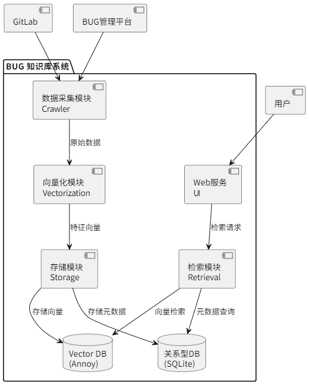
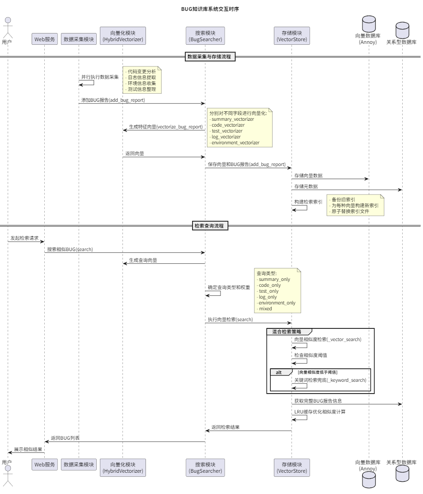

#### **1. 背景：BUG 知识管理的挑战与机遇**

BUG 知识库系统是一个基于 RAG（检索增强生成）技术的专业系统，旨在高效管理和检索软件开发过程中的 BUG 相关信息。该系统能够全方位存储和检索包括问题详情、代码上下文、错误日志和环境信息等多维度数据。

#### **2. 问题陈述：BUG 知识管理的现状与痛点**

在软件开发过程中，开发团队经常面临以下挑战：

- **信息分散**：BUG 信息分散在多个平台，难以统一管理
- **检索困难**：历史问题解决方案难以快速检索，导致重复问题解决效率低
- **碎片化管理**：缺乏对 BUG 相关代码、日志、环境等多维度信息的统一管理
- **智能化不足**：需要智能的相似性搜索来提高问题解决效率

#### **3. 解决方案：基于 RAG 的智能 BUG 知识库系统**

- 结构图

- 时序图

#### **4. 技术栈说明**
  - **[FastAPI](https://fastapi.tiangolo.com/)**: 现代、快速的 Web 框架，用于构建 API
  - **[Sentence Transformers](https://www.sbert.net/)**: 高效文本向量化工具
  - **[Annoy](https://github.com/spotify/annoy)**: 高性能近似最近邻搜索库
  - **[SQLite](https://www.sqlite.org/)**: 轻量级关系型数据库
  - **[APScheduler](https://apscheduler.readthedocs.io/)**: 强大的 Python 任务调度库
