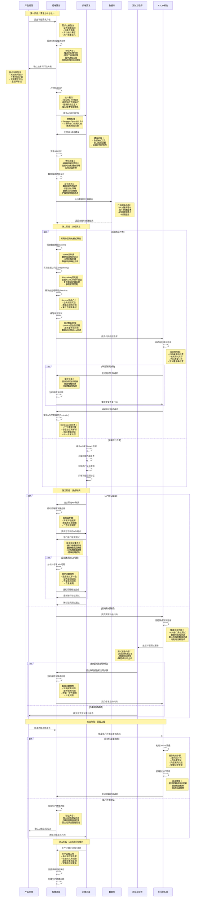

```mermaid
sequenceDiagram
    participant PM as 产品经理
    participant BE as 后端开发
    participant FE as 前端开发
    participant DB as 数据库
    participant QA as 测试工程师
    participant CI as CI/CD系统

    Note over PM,BE: 第一阶段：需求分析与设计
    PM->>BE: 提出功能需求文档
    Note right of BE: 需求文档包含：<br/>- 业务需求描述<br/>- 功能点清单<br/>- 非功能性要求<br/>- 用户故事定义
    BE->>BE: 需求分析和技术评估
    Note right of BE: 评估内容：<br/>- 技术可行性分析<br/>- 开发工作量估算<br/>- 技术选型方案<br/>- 风险评估和应对措施
    BE->>PM: 确认技术可行性方案
    Note left of PM: 技术方案包含：<br/>- 系统架构设计<br/>- 开发时间计划<br/>- 资源需求评估<br/>- 里程碑节点
    
    BE->>BE: API接口设计
    Note right of BE: 设计要点：<br/>- RESTful API规范<br/>- 请求/响应数据格式<br/>- 错误码规范定义<br/>- 接口版本管理策略
    BE->>FE: 提供API接口文档
    Note left of FE: 文档标准：<br/>- Swagger/OpenAPI 3.0<br/>- 详细的接口说明文档<br/>- 请求/响应示例
    FE->>BE: 反馈API设计建议
    Note right of FE: 建议内容：<br/>- 数据格式优化<br/>- 接口粒度调整<br/>- 前端使用便利性
    BE->>BE: 完善API设计
    Note right of BE: 优化调整：<br/>- 根据前端反馈优化<br/>- 性能考虑和缓存策略<br/>- 安全认证机制
    
    BE->>BE: 数据库表结构设计
    Note right of BE: 设计原则：<br/>- 数据库范式规范<br/>- 索引优化策略<br/>- 数据关系完整性<br/>- 扩展性和性能考虑
    BE->>DB: 执行数据库迁移脚本
    Note right of DB: 迁移脚本内容：<br/>- DDL建表语句<br/>- 索引创建脚本<br/>- 初始数据插入<br/>- 权限配置
    DB-->>BE: 返回表结构创建结果

    Note over BE,FE: 第二阶段：并行开发
    par 后端核心开发
        Note right of BE: 采用分层架构模式开发
        BE->>BE: 创建数据模型(Model)
        Note right of BE: Model层职责：<br/>- 数据验证规则定义<br/>- 业务对象封装<br/>- 数据库表映射关系
        BE->>BE: 实现数据访问层(Repository)
        Note right of BE: Repository层功能：<br/>- 数据库CRUD操作封装<br/>- 复杂查询逻辑实现<br/>- 事务管理控制
        BE->>BE: 开发业务逻辑层(Service)
        Note right of BE: Service层核心：<br/>- 业务规则实现<br/>- 数据处理和转换<br/>- 第三方服务集成
        BE->>BE: 编写单元测试
        Note right of BE: 测试覆盖范围：<br/>- Service层业务逻辑<br/>- 边界条件和异常<br/>- 数据访问层Mock测试
        BE->>CI: 提交代码到版本库
        CI->>CI: 自动运行单元测试
        Note right of CI: CI流程包含：<br/>- 代码编译和检查<br/>- 单元测试执行<br/>- 代码质量分析<br/>- 测试覆盖率检查
        alt 单元测试失败
            CI->>BE: 发送测试失败通知
            Note right of BE: 失败详情：<br/>- 具体失败测试用例<br/>- 错误堆栈信息<br/>- 代码覆盖率报告
            BE->>BE: 分析并修复问题
            BE->>CI: 重新提交修复代码
        end
        CI->>BE: 通知单元测试通过
        BE->>BE: 实现API控制器层(Controller)
        Note right of BE: Controller层职责：<br/>- HTTP请求处理<br/>- 参数验证和解析<br/>- 响应数据封装<br/>- 统一异常处理
    and 前端并行开发
        FE->>FE: 基于API文档Mock数据
        FE->>FE: 开发前端界面组件
        FE->>FE: 实现用户交互逻辑
        FE->>FE: 前端功能自测验证
    end
    
    Note over BE,FE: 第三阶段：集成联调
    par API接口联调
        FE->>BE: 请求开始API联调
        BE->>BE: 启动后端开发服务器
        Note right of BE: 服务器配置：<br/>- 开发环境配置<br/>- 数据库连接配置<br/>- 日志级别调整
        BE->>FE: 提供可访问的API端点
        FE->>BE: 进行接口联调测试
        Note left of FE: 联调测试重点：<br/>- 接口连通性验证<br/>- 数据格式正确性<br/>- 业务逻辑准确性<br/>- 错误处理机制
        alt 联调发现接口问题
            BE->>BE: 分析并修复API问题
            Note right of BE: 常见问题类型：<br/>- 数据格式不一致<br/>- 业务逻辑缺陷<br/>- 性能瓶颈问题<br/>- 安全漏洞
            BE->>FE: 通知问题修复完成
            FE->>BE: 重新进行验证测试
        end
        FE->>BE: 确认联调测试通过
    and 后端集成测试
        BE->>CI: 提交完整功能代码
        CI->>CI: 运行集成测试套件
        Note right of CI: 集成测试范围：<br/>- API接口集成测试<br/>- 数据库集成测试<br/>- 第三方服务集成测试<br/>- 端到端流程测试
        CI->>QA: 生成详细测试报告
        Note left of QA: 测试报告内容：<br/>- 测试用例通过率<br/>- 性能指标数据<br/>- 缺陷统计和分析
        alt 集成测试发现缺陷
            QA->>BE: 提交缺陷报告和复现步骤
            BE->>BE: 分析并修复集成问题
            Note right of BE: 集成问题类型：<br/>- 环境配置问题<br/>- 服务依赖问题<br/>- 数据一致性問題<br/>- 并发问题
            BE->>CI: 提交修复后的代码
        else 所有测试通过
            QA->>PM: 提交正式测试通过报告
        end
    end
    
    Note over PM,CI: 第四阶段：部署上线
    PM->>BE: 批准功能上线发布
    BE->>CI: 触发生产环境部署流水线
    par 自动化部署流程
        CI->>CI: 构建Docker镜像
        Note right of CI: 镜像构建步骤：<br/>- 源代码打包<br/>- 依赖库安装<br/>- 安全漏洞扫描<br/>- 镜像标签管理
        CI->>CI: 部署到生产环境
        Note right of CI: 部署策略：<br/>- 蓝绿部署或滚动更新<br/>- 健康检查机制<br/>- 自动回滚策略
        CI->>BE: 发送部署完成通知
    and 生产环境验证
        BE->>BE: 验证生产环境功能
        Note right of BE: 验证内容：<br/>- 核心业务流程测试<br/>- 性能监控指标检查<br/>- 日志记录完整性验证
        BE->>PM: 确认功能上线成功
        PM->>FE: 通知功能正式可用
    end
    
    Note over BE,FE: 第五阶段：正式运行和维护
    FE->>BE: 生产环境正式API调用
    Note right of BE: 生产运维工作：<br/>- 系统监控和告警<br/>- 性能优化和调整<br/>- 故障排查和处理<br/>- 定期维护和更新
    BE->>BE: 监控系统运行状态
    BE->>BE: 处理生产环境问题
```