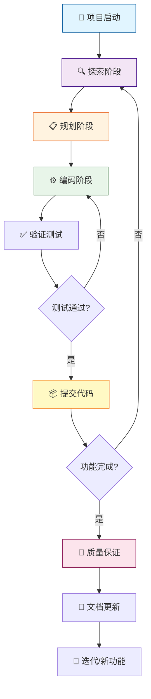

# 完整的长周期任务工作流

> **核心理念：** 探索 → 规划 → 编码 → 提交 + 持续验证

## 一、工作流概览



---

## 二、项目启动阶段

### 1. 环境准备

```bash
# 初始化项目结构（Windows bash / Linux / macOS）
mkdir -p .claude/{commands,agents}

# 创建核心配置文件
touch CLAUDE.md plan.md progress.md

```

### 2. 创建 CLAUDE.md 项目上下文

```bash
# 让 Claude 分析项目并生成上下文文档
"分析当前项目结构，创建详细的 CLAUDE.md 包括：
- 项目概述和技术栈
- 代码组织结构
- 编码规范和风格指南
- 测试策略
- 开发环境配置"
```

### 3. 配置 Subagents（可选）

创建专用智能体提升效率：

> 📄 **Agent 配置文件参考：** [common/agents/](common/agents/)

| Agent             | 职责                 | 文件路径                           | 模板参考 |
| ----------------- | -------------------- | ---------------------------------- | -------- |
| implementer       | 严格执行计划编码     | `.claude/agents/implementer.md`    | [查看模板](common/agents/implementer.md) |
| code-reviewer     | 代码质量审查         | `.claude/agents/code-reviewer.md`  | [查看模板](common/agents/reviewer.md) |
| test-runner       | 测试执行和验证       | `.claude/agents/test-runner.md`    | 自定义 |
| security-auditor  | 安全漏洞扫描         | `.claude/agents/security-auditor.md` | 自定义 |

```bash
# 查看可用 agents
/agents

# 使用 agent
"使用 implementer agent 执行 plan.md 的 Phase 1"
```

### 4. 创建自定义命令（可选）

> 📄 **命令文件模板参考：** [common/commands/](common/commands/)

```bash
# 常用命令建议（可从 common/commands/ 复制）
.claude/commands/create-plan.md      # 创建详细计划 → common/commands/create-plan.md
.claude/commands/process-task.md     # 执行特定阶段 → common/commands/process-task.md
.claude/commands/smart-commit.md     # 智能提交 → common/commands/smart-commit.md
.claude/commands/create-pr.md        # 创建 PR → common/commands/create-pr.md
```

---

## 三、核心工作流：Explore-Plan-Code-Commit

### 阶段 1：探索 (Explore) - Plan Mode

**目标：** 理解现有代码，零修改分析

```bash
# 启动 Plan Mode（只读模式）
claude --permission-mode plan

# 或在会话中切换（按 Shift+Tab 直到显示 ⏸ plan mode on）
```

**探索示例：**

```bash
# 架构分析
"分析用户认证模块的架构设计和数据流"

# 影响评估
"评估添加 OAuth2 功能对现有系统的影响范围"

# 依赖关系
"找出所有与支付处理相关的代码文件和依赖"

# 模式识别
"这个项目使用了什么设计模式？列出关键决策"
```

### 阶段 2：规划 (Plan) - 创建执行计划

**目标：** 将任务分解为可执行的检查清单

```bash
# 触发深度思考（复杂任务）
"think harder 为 OAuth2 功能创建详细的实施计划"

# 或使用自定义命令
/create-plan OAuth2 第三方登录功能
```

**plan.md 结构模板：**

> 📄 **完整模板参考：** [common/templates/plan.md](common/templates/plan.md)

```markdown
# 功能：[功能名称]

## 概述
[简要说明功能目标和范围]

## Phase 1: [阶段名称] (预计时间)
- [ ] 1.1 [具体任务]
- [ ] 1.2 [具体任务]
- [ ] 1.3 验证和测试

## Phase 2: [阶段名称] (预计时间)
...

## 技术决策
| 决策项 | 选择 | 理由 |

## 潜在风险
⚠️ 风险描述 + 缓解措施

## 完成标准
- ✅ 测试覆盖率 > 80%
- ✅ 代码审查通过
- ✅ 文档完整
```

### 阶段 3：编码 (Code) - 分步执行

**切换到执行模式：**

```bash
# 退出 Plan Mode（按 Shift+Tab）
# 推荐：Auto-Accept Mode (⏵⏵) 用于重复性任务
```

**逐阶段执行：**

```bash
# 方式 1: 明确指定阶段
"按照 plan.md Phase 1，执行所有步骤并更新检查清单"

# 方式 2: 使用自定义命令
/process-task 1

# 方式 3: 使用 implementer agent
"使用 implementer agent 执行 Phase 1"
```

**执行原则：**
- ✅ 每完成一步立即测试
- ✅ 更新 plan.md 标记 `[x]`
- ✅ 遇到问题记录到 progress.md
- ✅ 小步提交，避免大爆炸

### 阶段 4：验证 (Verify) - 持续测试

```bash
# 单元测试
"运行与当前更改相关的单元测试"

# 集成测试
"运行完整的测试套件验证 Phase 1"

# 使用 test-runner agent
"使用 test-runner agent 执行所有测试并生成报告"
```

### 阶段 5：提交 (Commit) - 规范记录

```bash
# 智能提交
/smart-commit

# 或手动指导
"分析 git diff，生成符合 Conventional Commits 的提交消息
格式：<type>(<scope>): <subject>
类型：feat/fix/refactor/test/docs"

# 创建 Pull Request
/create-pr

# 或详细说明
"创建 PR 包括：
- 从 plan.md 提取功能概述
- 列出所有完成的任务
- 包含测试结果
- 链接相关 Issue"
```

---

## 四、进度跟踪和管理

### 1. 维护 progress.md

> 📄 **完整模板参考：** [common/templates/progress.md](common/templates/progress.md)

```markdown
# 项目进度跟踪

## 📊 当前状态
- **阶段**: Phase 2/5
- **进度**: 40% (8/20 tasks)
- **预计完成**: 2025-10-20

## ✅ 已完成
- [x] Phase 1: 数据模型设计

## 🔄 进行中
- [ ] Phase 2: OAuth 核心逻辑 (60%)

## ❗ 阻碍问题
### 问题 1: Token 刷新策略
- 描述：Google 和 GitHub 机制不同
- 影响：延迟 0.5 天
- 方案：使用策略模式
- 状态：待讨论

## ⏭️ 下一步
1. 完成 OAuth callback 处理
2. 实现 token 刷新逻辑
```

### 2. 定期更新 CLAUDE.md

```bash
# 在里程碑更新项目文档
"更新 CLAUDE.md 记录：
- 新完成的 OAuth2 功能
- 新增的依赖和配置
- 更新的 API 端点
- 新的测试要求"
```

---

## 五、上下文管理（70% 规则）

### 监控和优化

```bash
# 检查上下文使用情况
/context

# 当达到 70% 时压缩上下文
/compact

# 或者清理上下文开始新功能
/clear
```

### 外部记忆策略

将重要信息存储到文件而非对话：

- 📋 **plan.md** - 执行计划（[模板](common/templates/plan.md)）
- 📈 **progress.md** - 进度跟踪（[模板](common/templates/progress.md)）
- 📚 **CLAUDE.md** - 项目上下文
- 📝 **decisions.md** - 技术决策记录

---

## 六、质量保证流程

### 1. 代码审查

```bash
# 使用 code-reviewer agent
"使用 code-reviewer agent 审查当前 PR，检查：
- 代码质量和可读性
- 安全漏洞
- 性能问题
- 测试覆盖率"
```

### 2. 安全审计

```bash
# 使用 security-auditor agent
"使用 security-auditor agent 扫描：
- 暴露的密钥和凭证
- SQL 注入风险
- XSS 漏洞
- 敏感数据处理"
```

### 3. 完成检查清单

- [ ] 所有测试通过（覆盖率 > 80%）
- [ ] 代码审查通过
- [ ] 安全审计通过
- [ ] API 文档更新
- [ ] CLAUDE.md 更新
- [ ] CHANGELOG 更新

---

## 七、完整流程示例

```bash
# ========== 项目启动 ==========
cd my-project
mkdir -p .claude/{commands,agents}
touch CLAUDE.md plan.md progress.md

"分析项目创建 CLAUDE.md"

# ========== 探索阶段 ==========
claude --permission-mode plan

"探索用户认证模块，评估添加 OAuth2 的影响"
"分析相关代码文件和依赖关系"

# ========== 规划阶段 ==========
"think harder 创建 OAuth2 实施计划，保存到 plan.md
包括：5个阶段、详细步骤、技术决策、风险评估"

# 人工审查 plan.md 并调整

# ========== 编码阶段 ==========
[按 Shift+Tab 退出 Plan Mode]

"执行 plan.md Phase 1，完成后更新检查清单"
"运行单元测试验证 Phase 1"
/smart-commit

"执行 plan.md Phase 2"
"运行集成测试"
/smart-commit

# 重复执行所有 Phase...

# ========== 质量保证 ==========
"使用 code-reviewer agent 审查所有代码"
"使用 security-auditor agent 扫描漏洞"
"修复发现的问题"

# ========== 提交和部署 ==========
/create-pr
"更新 CLAUDE.md 和文档"
/clear

# ========== 安全实践 ==========
git commit -m "WIP: before major refactor"  # 重大操作前
```

---

## 八、最佳实践速查

### ✅ 应该做的

- ✅ 复杂任务前先用 Plan Mode 探索
- ✅ 创建详细的 Markdown 检查清单
- ✅ 分阶段执行，每步验证
- ✅ 使用外部文件（plan.md）管理任务
- ✅ 定期提交，避免大爆炸
- ✅ 使用规范的 commit message
- ✅ 在 70% 上下文时压缩或清理
- ✅ 重大操作前创建 WIP 提交

### ❌ 不应该做的

- ❌ 跳过探索直接编码
- ❌ 使用过于粗略的计划
- ❌ 一次实现所有功能
- ❌ 跳过测试或延迟测试
- ❌ 随意的 commit message
- ❌ 让 Claude 做重要架构决策
- ❌ 同时进行多个不相关功能

---

## 九、权限模式切换

```
Normal Mode → [Shift+Tab] → Auto-Accept Mode (⏵⏵) → [Shift+Tab] → Plan Mode (⏸)
    ↑                                                                    ↓
    └────────────────────────── [Shift+Tab] ──────────────────────────┘
```

| 模式                  | 用途                     | 图标 |
| --------------------- | ------------------------ | ---- |
| Normal Mode           | 默认，每步确认           | -    |
| Auto-Accept Mode      | 自动执行，适合重复性任务 | ⏵⏵   |
| Plan Mode             | 只读分析，适合探索       | ⏸    |

---

## 十、深度思考触发词

处理复杂问题时使用：

| 触发词         | 用途           | 场景示例                   |
| -------------- | -------------- | -------------------------- |
| `think`        | 基础思考       | 简单重构决策               |
| `think hard`   | 深度思考       | 复杂功能设计               |
| `think harder` | 更深度思考     | 架构重构方案               |
| `ultrathink`   | 极限思考       | 遗留系统迁移策略           |

```bash
# 示例
"ultrathink 5000行遗留代码的最佳重构策略是什么？
需要考虑：风险、成本、时间、回滚方案"
```

---

## 附录：推荐项目结构

> 📄 **配置文件模板参考：** [common/](common/) 目录

```
your-project/
├── .claude/
│   ├── commands/              # 自定义命令
│   │   ├── create-plan.md     # 参考: common/commands/create-plan.md
│   │   ├── process-task.md    # 参考: common/commands/process-task.md
│   │   ├── smart-commit.md    # 参考: common/commands/smart-commit.md
│   │   └── create-pr.md       # 参考: common/commands/create-pr.md
│   ├── agents/                # Subagents
│   │   ├── implementer.md     # 参考: common/agents/implementer.md
│   │   ├── code-reviewer.md   # 参考: common/agents/reviewer.md
│   │   ├── test-runner.md
│   │   └── security-auditor.md
│   └── settings.json
├── CLAUDE.md                  # 项目上下文
├── plan.md                    # 当前计划（参考: common/templates/plan.md）
├── progress.md                # 进度跟踪（参考: common/templates/progress.md）
└── decisions.md               # 技术决策记录（可选）
```

---

## 总结

**长周期任务成功的关键：**

1. 🔍 **探索优先** - Plan Mode 理解再行动
2. 📋 **计划细化** - Markdown 检查清单可视化
3. 🎯 **分步执行** - 小步快跑，持续验证
4. 🤖 **工具赋能** - Subagents 和自定义命令
5. 💾 **外部记忆** - 文件存储而非对话
6. 🧪 **质量优先** - 每步测试，代码审查
7. 📝 **规范提交** - 清晰的版本历史

**记住：** Claude Code 是你的开发伙伴，负责执行；你负责决策和方向把控。

