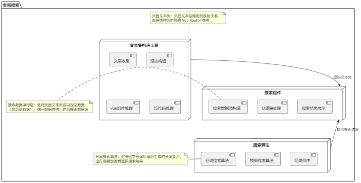
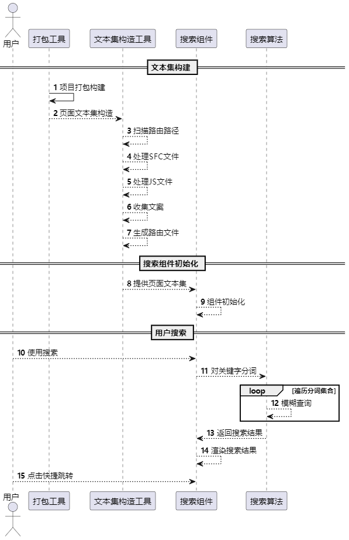

## 如何构建专业的页面全局搜索？

### 1. 引言

- **背景介绍**：在静态页面中，搜索功能是提升用户体验的关键之一，尤其在内容量较大时，全局搜索能帮助用户高效找到信息。本文聚焦如何在静态页面中构建一个高效的全局搜索系统。
- **文章目标**：探讨静态页面全局搜索的设计与实现，包括搜索框设计、分词算法应用、性能优化等方面。

### 2. 全局搜索的基本概念

- **什么是页面静态全局搜索？**
  - 静态全局搜索指在网页加载后，搜索功能完全依赖客户端本地数据（如 JSON 文件或预构建的索引），无需请求后端服务器。这种方式适用于小型网站、文档站点或内容固定的管理系统。
  - **关键特点**：
    - **全局性**：能跨页面搜索数据。
    - **静态性**：搜索数据在前端已加载，无需实时网络请求。
- **核心组件**：
  1. **搜索框**：用户输入查询关键词的交互入口，直接影响用户体验。
  2. **搜索算法**：执行关键词匹配、模糊查询等操作，返回结果。
  3. **搜索结果展示**：清晰、直观地展示匹配结果，支持用户快速操作。

### 3. 搜索框设计与用户交互

- **输入提示与自动补全**：
  - **功能**：显示搜索建议（如历史记录、推荐词等）和自动补全，减少用户输入成本。
  - **设计要点**：
    1. 提供关键词推荐和历史记录。
    2. 实时更新建议列表，根据用户输入动态调整。
    3. 支持键盘导航和鼠标选择，提高操作便捷性。
  - **适用场景**：用户不确定完整关键词时，自动补全尤为有效。
- **搜索触发方式**：

  - **实时搜索**：用户每次输入时触发搜索，适用于小型数据量的场景。
  - **按键触发**：用户按下回车键后提交搜索，适用于需要复杂筛选条件的场景。
  - **性能权衡**：实时搜索提高体验但占用更多性能；按键触发更适合大数据量处理。

- **分页与加载优化**：

  - 分页显示：适合大数据量时的搜索结果展示。
  - 无限滚动：加载用户当前可见范围的内容，提升交互流畅性。
  - 虚拟滚动：通过虚拟 DOM 技术，只渲染用户视野中的结果。

- **错误处理与容错机制**：
  - **友好提示**：当用户输入错误或无匹配结果时，显示“无匹配结果”提示并引导重新搜索。
  - **模糊匹配**：支持“拼音纠错”或“Did you mean?”功能，提供更智能的容错体验。

### 4. 分词算法的介绍与应用

- **分词的重要性**：
  - 在中文或其他非空格分隔的语言中，分词是实现搜索功能的基础步骤。分词将一段文本拆分为单个词语，便于检索。
- **常见分词算法**：
  - 基于字典的最大匹配算法（MM）：
    - 简单高效，适合静态场景。
  - 基于统计的分词算法（如 HMM、CRF）：
    - 精度较高，适用于需要复杂语义理解的场景。
  - 深度学习方法：
    - 基于 Transformer 等模型，适合对精确度要求较高的复杂应用。
- **推荐分词库**：
  1. **[nodejieba](https://www.npmjs.com/package/nodejieba)**：高效中文分词库，支持自定义词典扩展。
  2. **[segmentit](https://www.npmjs.com/package/segmentit)**：轻量级分词工具，适合专业领域的自定义扩展。
- **静态页面中的分词应用**：
  - 页面加载时预处理文本集并生成分词索引。
  - 查询时，先对输入内容分词，再匹配索引数据返回结果。
- **优化技巧**：
  - 支持同义词匹配与拼音模糊搜索。
  - 动态更新分词词典，提升匹配精准度。

### 5. 性能优化

- **前端优化**：
  - **防抖与节流**：限制用户频繁输入导致的搜索调用，减少性能浪费。
  - **懒加载**：延迟加载搜索结果或索引，优化首次渲染体验。
- **数据结构优化**：
  - **倒排索引**：构建关键词与页面的高效映射关系，实现快速查询。
  - **分片存储**：将大型索引分片加载，减少内存占用。

### 6. 整体设计

- 结构图

  

- 流程图

  

### 7. 技术栈

- **[segmentit](https://www.npmjs.com/package/segmentit)**
- **[vue-demi](https://www.npmjs.com/package/vue-demi)**
- **[vite](https://www.npmjs.com/package/vite)**
- **[@vue/compiler-dom](https://www.npmjs.com/package/@vue/compiler-dom)**
- **[jscodeshift](https://www.npmjs.com/package/jscodeshift)**
