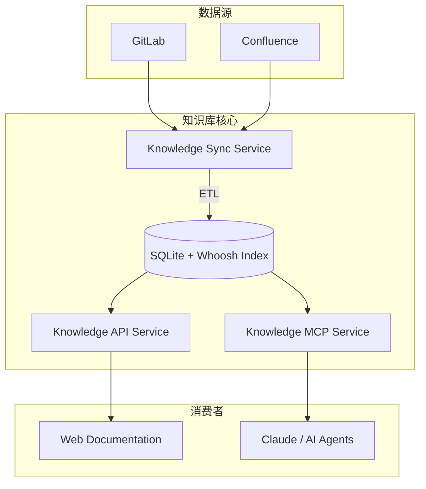
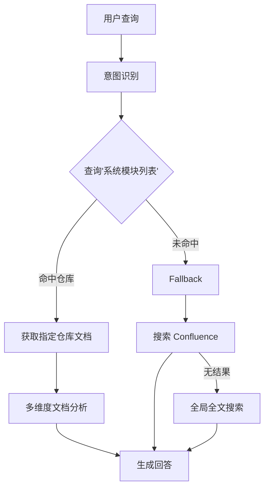

在当今的企业环境中，知识的碎片化是一个普遍痛点。技术文档散落在 GitLab 代码仓库中，产品需求分布在 Confluence 页面上，而团队成员往往需要在多个平台间反复切换以寻找所需信息。

更关键的是，随着 AI 辅助开发的普及，如何让 Claude 等 AI Agent "读懂" 企业内部的私有知识，成为了提升效能的关键瓶颈。

本文将介绍一个 **基于 MCP (Model Context Protocol) 的现代企业知识库系统**，它不仅统一了文档管理，更打通了从文档到 AI 的"最后一公里"。

## 🏗️ 核心设计理念

该系统的构建围绕着三个核心理念展开，旨在解决传统知识库"只存不用"和"难以维护"的问题：

1.  **Automation First (自动化优先)**：文档应该在它产生的地方被管理（如代码仓库），而不是被手动复制到知识库。系统通过自动化同步机制，确保知识库内容永远是最新的。
2.  **Unified Access (统一访问)**：无论源头是 Markdown 文件还是 Confluence 页面，对上层应用来说，它们都应该是标准化的文档对象，通过统一的 API 访问。
3.  **AI Native (AI 原生)**：不只是为人服务，更要为 AI 服务。通过原生支持 MCP 协议，让 AI Agent 能够像调用函数一样检索和阅读企业知识。

## 📐 系统架构

系统采用 **MonoRepo** 结构进行管理，主要包含三个核心微服务，形成了一个完整的 ETL（Extract, Transform, Load）与服务闭环：

### 核心组件

*   **Knowledge Sync (同步服务)**：负责从 GitLab 和 Confluence 定期拉取更新，进行清洗、格式化，并更新搜索索引。
*   **Knowledge API (API 服务)**：提供标准的 RESTful 接口，用于构建 Web 前端展示或供其他系统集成。
*   **Knowledge MCP (MCP 服务)**：实现了 Model Context Protocol，作为 AI Agent 的"知识插件"。

## 🔑 关键技术方案

### 1. 多源异构数据的统一同步

为了解决文档格式不一致的问题，系统设计了一套抽象的 **Source Adapter (源适配器)** 模式。无论源数据是 Git 仓库中的 Markdown，还是 Confluence 的 HTML，都会被转换为统一的中间格式：

*   **GitLab**: 自动克隆/拉取仓库，提取指定目录下的 Markdown 文件。
*   **Confluence**: 调用 Atlassian API 获取页面内容，并转换为 Markdown 格式。

这种设计使得未来扩展新的数据源（如 Notion, Google Docs）变得非常容易，只需实现对应的 Adapter 即可。

### 2. 本地化的智能搜索引擎

考虑到数据隐私和响应速度，系统没有依赖外部搜索服务，而是集成了 **Whoosh** —— 一个纯 Python 实现的全文检索引擎库。

针对中文环境，我们定制了分词器：

*   集成 **Jieba** 分词组件，实现精准的中文分词。
*   支持 **自定义词典** (`custom_dict.txt`)，确保"微服务"、"容器化"、"Kubernetes"等技术专有词汇能被准确索引，而不是被切分成零散的字。

### 3. MCP：打通 AI 的神经末梢

这是本系统最独特的亮点。通过实现 **Model Context Protocol (MCP)**，知识库不再是一个静态的网页，而变成了一个**可被 AI 调用的工具集**。

我们在 MCP 服务中通过 `@mcp.tool()` 装饰器暴露了核心能力：

*   `search_knowledge(query)`: 允许 AI 搜索知识库，获取相关文档片段。
*   `get_document(id)`: 允许 AI 读取特定文档的完整内容。
*   `get_categories()`: 允许 AI 了解知识库的结构分类。

**实战场景**：
当你在 Claude 中提问："我们公司的 API 鉴权流程是怎样的？"
1.  Claude 会自动调用 `search_knowledge("API 鉴权")`。
2.  MCP 服务在 Whoosh 索引中检索相关文档。
3.  Claude 读取返回的文档摘要，并基于此生成准确的答案，甚至通过 `get_document` 读取完整技术规范来辅助代码编写。

## 🧠 进阶实战：构建智能搜索 Agent

仅仅暴露基本的搜索 API (Search) 是不够的。为了让 AI 提供更精准的回答，我们需要构建一个具备 **Agentic Workflow**（代理工作流）的高级 Agent。

以下是我们定义的 **搜索增强 Agent** 的核心逻辑，它展示了如何通过 MCP 编排复杂的检索策略：

### 1. 意图识别 (Intent Classification)

Agent 首先会分析用户的自然语言查询，将其归类为以下核心意图，从而决定后续关注的文档类型：

*   **技术实现类** (关键词：代码、函数)：关注 `apiReference`, `systemArchitecture`
*   **业务流程类** (关键词：工作流、步骤)：关注 `businessWorkflows`
*   **架构设计类** (关键词：模块、设计)：关注 `systemArchitecture`

### 2. "索引优先"策略 (Index-First Strategy)

为了避免在海量文档中"大海捞针"，我们强制 Agent 执行一个 **"查索引"** 的前置动作。

Agent 会优先调用 `get_document("系统模块列表")`，这是一个维护了所有系统元数据的特殊文档。
*   **命中索引**：如果查询词匹配到了具体的仓库ID（如 `auth-service`），Agent 将使用 `get_documents_by_project_id` 精确获取该仓库下的文档集合。
*   **未命中**：只有当索引未命中时，才会回退到 `search_documents_by_source` (Confluence) 或 `search_knowledge` (全局搜索)。

### 3. 工作流可视化

这个智能检索流程确保了 AI 不会因为关键词的泛化匹配而产生幻觉，而是像资深工程师一样，先定位系统，再查阅细节。

> 💡 **提示**：完整的 Agent 提示词定义文件位于 [common/agents/knowledge-base-search.md](./common/agents/knowledge-base-search.md)，您可以直接复用该 Prompt 来构建自己的 Claude Project。

## 🚀 结语

通过构建这样一个基于 MCP 的知识库，我们不仅仅是在管理文档，而是在**将企业的隐性知识转化为 AI 可理解的显性资产**。

它让技术文档的价值得以最大化释放：对人，它是统一的查阅平台；对 AI，它是可靠的外部大脑。在即将到来的 AI Agent 时代，这种基础设施将成为研发团队的核心竞争力。
