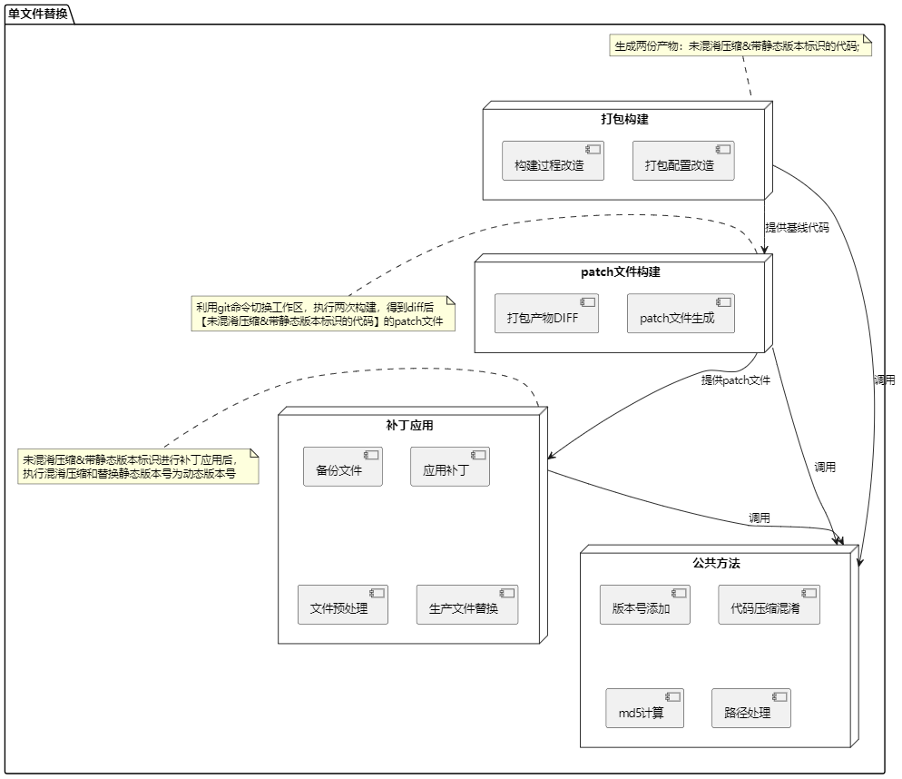
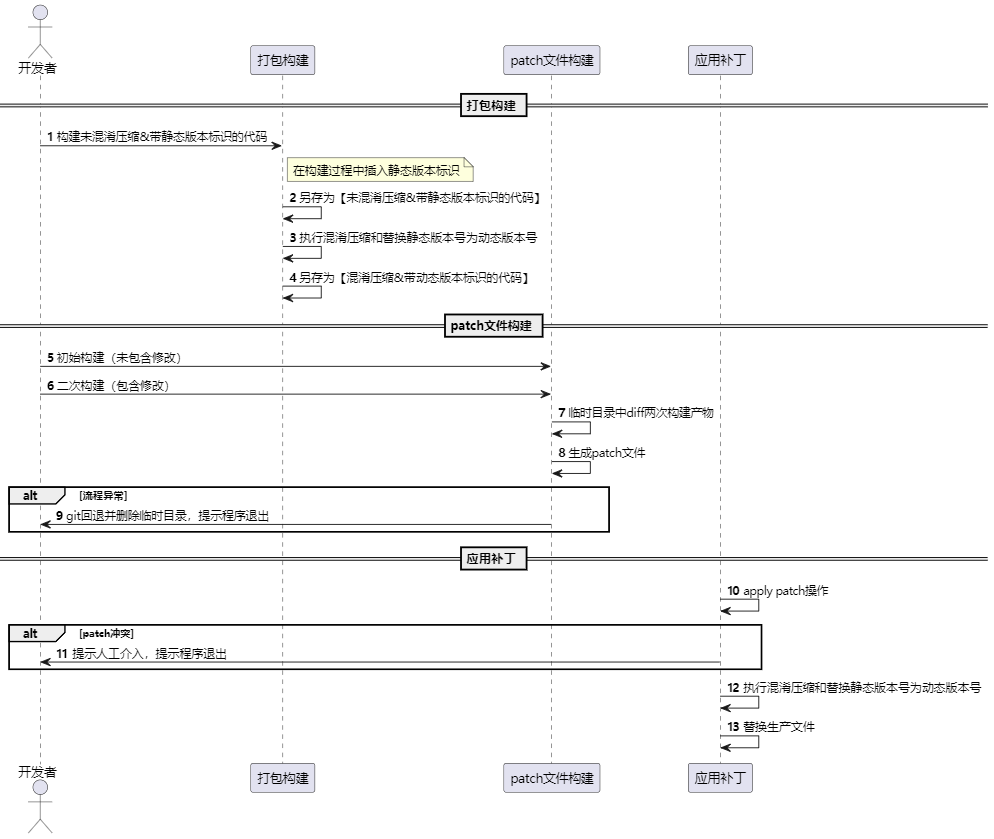

#### **1. 引言**

在现代前端开发中，随着应用变得越来越复杂，资源的更新与管理变得愈加重要。单文件替换作为一种高效的资源更新机制，特别适用于频繁更新版本或需要快速修复 Bug 的场景。与全量替换相比，单文件替换不仅能够显著减少更新的复杂度，还能避免大规模的版本改动迁移，从而提升开发效率。

然而，单文件替换并非易事，它涉及构建改造、补丁生成、补丁应用、容错处理等多个技术环节。本文将从实际需求出发，深入探讨前端单文件替换的设计方案与与实现，帮助开发者实现高效、可靠的单文件替换方案。

#### **2. 需求分析**

**2.1 应用场景**

单文件替换的应用场景包括但不限于：

1. **前端版本更新**

   在传统的前端应用中，每次版本更新通常需要重新部署整个应用，而单文件替换能够避免这种“全量更新”的负担。通过仅替换受影响的文件，减少资源消耗，并且缩短更新时效，特别适用于在高频次更新的应用中，例如电商平台、新闻网站等。

2. **快速修复**

   在线上出现 Bug 或紧急问题时，传统的全量更新可能会浪费大量时间，而单文件替换可以迅速替换发生问题的文件（如 JavaScript、CSS），实现紧急修复。对于大规模应用或涉及多个用户的产品，这种方式具有显著的优势。

3. **跨版本兼容**
   在支持多个版本或进行渐进式迁移的项目中，单文件替换可以在不同版本之间无缝衔接。例如，在微前端架构下，不同子应用可能需要独立更新，单文件替换能够确保各部分的兼容性，而无需重新部署所有模块。

**2.2 挑战与限制**

实现单文件替换通常面临以下挑战：

1. **缓存问题**
   浏览器缓存机制是前端开发中常见的障碍。浏览器为了提升性能，会缓存文件，避免频繁请求相同的资源。然而，当文件替换时，浏览器可能依然加载缓存中的旧文件，从而导致更新未生效。开发者需要巧妙地利用版本化、时间戳、或者 `Cache-Control` 等机制，确保每次替换的文件能够被正确加载。

2. **兼容性要求（打包工具）**
   使用打包工具（如 Vite、Webpack）实现单文件替换时，兼容性问题尤为突出。不同的打包工具可能在文件处理、版本化、缓存控制等方面的实现细节不同，导致替换操作在不同环境下的表现不一致。

3. **增量包构建**
   在大规模的前端项目中，单文件替换可能涉及大量的资源和模块，增量构建就成为了一个关键问题。通常，构建工具会对整个项目进行打包，但如果文件之间有复杂的依赖关系，替换时可能需要重新构建或更新多个相关文件，导致额外的构建时间和计算资源消耗。如何高效实现增量更新，确保只替换发生变动的文件，也是一个艰巨的挑战。

#### **3. 整体设计**

- 结构图

- 流程图

#### **4. 技术栈说明**

- **[@swc/core](https://www.npmjs.com/package/@swc/core)**: 一个高性能的 JavaScript/TypeScript 编译器，提供快速的编译能力，支持多种转换操作。
- **[adm-zip](https://www.npmjs.com/package/adm-zip)**: 用于创建和解压 ZIP 文件的库，提供简单的 API 来处理 ZIP 格式文件。
- **[cheerio](https://www.npmjs.com/package/cheerio)**: 一个轻量级的、快速的 jQuery 核心实现，用于服务器端 HTML 解析和操作。
- **[fs-extra](https://www.npmjs.com/package/fs-extra)**: 扩展了 Node.js 原生的 `fs` 模块，提供额外的文件系统操作功能，如递归删除、复制等。
- **[jscodeshift](https://www.npmjs.com/package/jscodeshift)**: 代码转换工具，用于通过抽象语法树（AST）进行 JavaScript 代码的自动化重构。
- **[p-limit](https://www.npmjs.com/package/p-limit)**: 控制并发执行的数量，常用于限制 Promise 的并发数，避免资源过度消耗。
